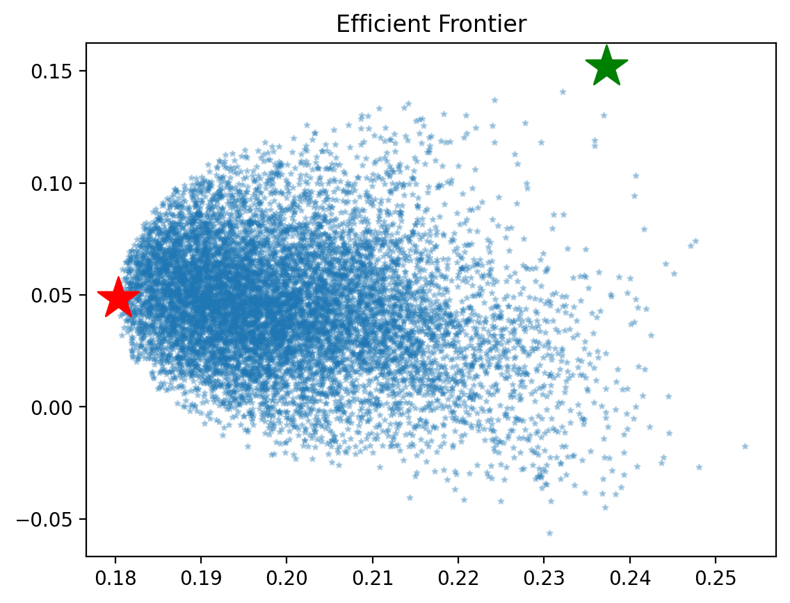

# Robo Advisor Lite

## Project Overview

This tool gives an overview of some trends in the ASX stock market, within varying sectors, and allows the user to choose up to five stocks to be analysed using data from Yahoo Finance. The analysis provides five years of the stocks' price movement in a graph, along with general information and some current important financial values. It will run a monte carlo simulation on the user selected stock with user-provided weights. It will also calculate the optimal portfolio distribution and run monte carlo simulation against optimal weights.

### Current Market Trends

The landing page of the application will display the plot highlighting how the different sectors are performing monthly and annualy.
It will also display the volatility of all ASX listed stocks.

### Efficient Frontier

As a cornerstone in Modern Portfolio Theory, Efficient Frontier was introduced by Harry Markowitz. By taking Compound Annual Growth Rate (CAGR) as Return and Standard Deviation (Annualized) as Risk metric a chart is plotted to graphically represent portfolios with various weights associated to each asset of the portfolio. The aim of this chart is to select the portfolio with highest level of return with investors degree of risk tolerance.

### Monte Carlo Simulation

The advise page of the application allows user to select upto 5 different ASX listed stocks. It will then display the plot showing how the selected stocks are performing in last 5 years. It will also display the correlation map for the selected stocks.
Additionally it will display the general and the financial information of the selected stocks.

Once user has reviewed the provided data, application now allows user to input the amount of money he/she wants to invest and also the distribution of money among each stock. The application will then run Monte Carlo simulation and will provide the user with 95% confidence level of minumum and maximum value of their money after 30 years.

It will also calculate optimal weights and efficient frontier and then run monte carlo simulation with optimal weights

## Usage and Installation Instructions

This application requires below libraries to be installed. It is recommended to use the manager, Conda, however other package and environment management systems can be used. The following dependancies are required:

- pandas
- yahoofinancials
- yfinance
- matplotlib
- holoviews
- streamlit

To run the application
- navigate to robo_adviser_lite/streamlit
- streamlit run roboAdvisor.py --server.port 8501

Streamlit only supports Bokeh version 2.4.1. Please install this specific version if you see below error:

## Example of Results and Summary

The landing page display below plots
- Monthly Performance for each sector

- Annual Performance for each sector

- Volatility of each stock

The advise page display below plots
- Last 5 years Performance for user selected stocks

- Sharp Ratios for user selected stocks 

- Monte Carlo Simulation results for user selected stocks

- Optimal Portfolio 

